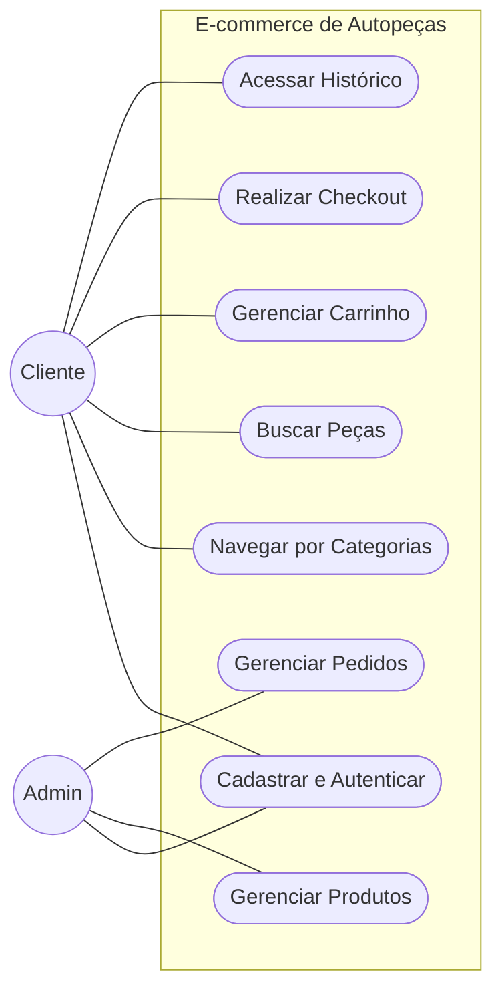
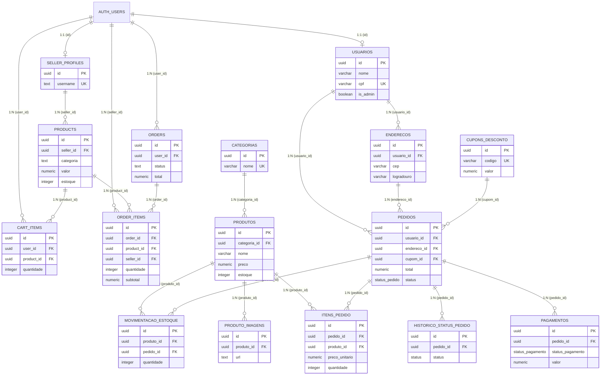
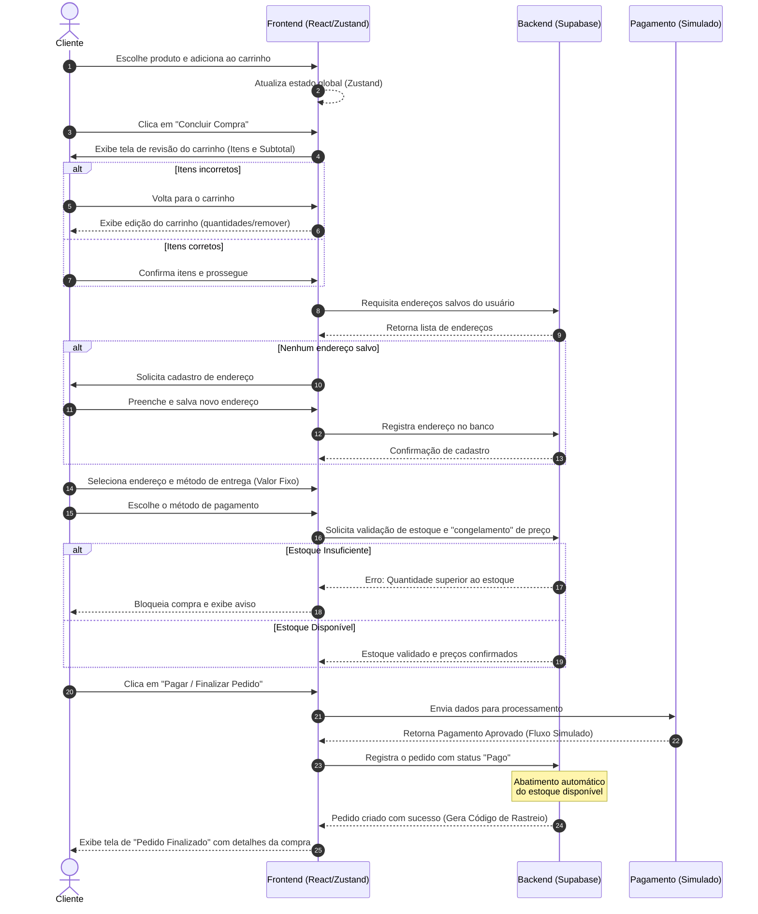

# **Documento de Especificação de Requisitos e Arquitetura de Software (SRS)**

**Projeto:** E-commerce de Autopeças (AutoPro)  
**Versão:** 1.1.0  
**Status:** Em Desenvolvimento  
**Data:** 12 de Agosto de 2026

## **Informações de Identificação**
* **Autor:** Humberto Araujo Ribeiro Neto  
* **Equipe de Desenvolvimento:** Humberto Araujo Ribeiro Neto, Mauro Celestino Alves Junior, Thierry Monteiro Assis Santos  
* **Instituição:** FATEC Taubaté — Análise e Desenvolvimento de Sistemas (1º Ano)  
* **Prazo de Execução:** 1 Mês (4 Semanas)

---

## **1. Visão Geral do Sistema**

O sistema consiste em uma plataforma de comércio eletrônico voltada ao setor de autopeças. 
* **Objetivo:** Vender produtos pela internet com segurança e rapidez, validando a viabilidade técnica e comercial com uma infraestrutura escalável e de baixo custo.
* **Público-alvo:** Clientes finais (compradores donos de veículos ou mecânicos) e administradores da loja (gestores de estoque e vendas).
* **Escopo principal:** Catálogo de produtos digitais, carrinho de compras, processamento de pagamentos e painel administrativo restrito.

O ecossistema é composto por duas interfaces principais integradas a um núcleo de serviços em nuvem: a **Loja Virtual (B2C)** e o **Painel Administrativo (B2B)**.

---

## **2. Arquitetura e Stack Tecnológica**

A solução adota uma arquitetura de *Single Page Application (SPA)* conectada a uma plataforma *Backend as a Service (BaaS)*, seguindo a separação de responsabilidades.

* **Frontend (Interface do Usuário):** O que o cliente vê no navegador. Construído com **React (Vite)** e **Tailwind CSS**. Gerenciamento de estado global (como sessões e carrinho) feito nativamente com a **React Context API**.
* **Backend (Regras de Negócio):** O "cérebro" do sistema. Utiliza o **Supabase** (que roda Node.js/PostgREST nos bastidores) para gerenciar autenticação via JWT, regras de acesso (RLS) e *Storage* de imagens.
* **Banco de Dados:** Onde ficam salvas as informações. Utiliza **PostgreSQL** hospedado em nuvem (via Supabase).
* **Hospedagem & Infraestrutura:** **Vercel** para deploy contínuo do frontend.
* **Integrações Externas (Previstas/Simuladas no MVP):** 
  * *Gateway de Pagamento:* Mercado Pago / Stripe (fluxo simulado na versão inicial).
  * *Serviço de Frete:* API dos Correios / Melhor Envio (valor fixado no MVP para testes).

---

## **3. Requisitos do Sistema**

### **3.1. Requisitos Funcionais (RF - O que o sistema faz)**
| ID | Descrição do Requisito | Prioridade |
| :--- | :--- | :--- |
| **RF01** | O usuário deve conseguir criar uma conta e fazer login (Clientes e Administradores). | Alta |
| **RF02** | O sistema deve permitir buscar produtos por nome ou por categoria (ex: Motor, Suspensão). | Alta |
| **RF03** | O cliente deve conseguir adicionar itens ao carrinho, atualizar quantidades e finalizar a compra. | Alta |
| **RF04** | O administrador deve conseguir cadastrar, atualizar, remover produtos e alterar preços (CRUD). | Alta |
| **RF05** | O sistema deve calcular automaticamente o valor total da compra em tempo real no carrinho. | Alta |
| **RF06** | O administrador deve conseguir visualizar e alterar os status dos pedidos recebidos. | Média |

### **3.2. Requisitos Não Funcionais (RNF - Como o sistema se comporta)**
| ID | Descrição do Requisito |
| :--- | :--- |
| **RNF01** | **Desempenho:** O site deve carregar as páginas e vitrines em menos de 3 segundos, utilizando a otimização de build do Vite. |
| **RNF02** | **Disponibilidade:** O sistema deve ficar no ar 99,9% do tempo, garantido pelos SLAs da Vercel e do Supabase. |
| **RNF03** | **Escalabilidade:** O estado global da aplicação (como o carrinho de compras) deve ser gerenciado de forma eficiente e centralizada através da Context API do React. |
| **RNF04** | **Segurança & Privacidade:** Os dados sensíveis e de pagamento devem ser criptografados e o sistema deve seguir diretrizes da **LGPD** e princípios básicos do **PCI-DSS**. |
| **RNF05** | **Usabilidade:** A interface deve ser *Mobile-First*, totalmente responsiva em qualquer tela via Tailwind CSS. |

---

## **4. Modelagem de Dados Básica**

A estrutura principal do banco de dados relacional foi desenhada em torno das seguintes entidades:

* **Usuário:** `ID` (PK), `nome`, `e-mail`, `senha` (hash criptografado via Auth), `endereço`, `papel_usuario` (admin/cliente).
* **Produto:** `ID` (PK), `nome`, `descrição`, `preço`, `quantidade em estoque`, `categoria_id`.
* **Pedido:** `ID` (PK), `data`, `status` (pendente, pago, enviado), `valor total`, `ID do usuário` (FK).
* **Item do Pedido:** `ID` (PK), `ID do pedido` (FK), `ID do produto` (FK), `quantidade`, `preço unitário` (salvo no momento da compra para garantir imutabilidade).

---

## **5. Diagramas Essenciais**

### **5.1. Diagrama de Casos de Uso**
Mostra as permissões e interações entre os clientes finais e os administradores.



### **5.2. Diagrama Entidade-Relacionamento (DER)**

Exibe como as tabelas essenciais do banco de dados se relacionam.



### **5.3. Diagrama de Sequência (Fluxo de Compra)**

Mostra o passo a passo da jornada do cliente, do clique em "Comprar" até a finalização do pedido.



---

## **6. Regras de Negócio (RN)**

1. **Bloqueio de Estoque:** O sistema não deve permitir a finalização da compra caso a quantidade solicitada seja superior ao saldo em estoque.
2. **Imutabilidade de Preços:** O preço do produto deve ser copiado para o `Item do Pedido` no ato da compra. Alterações futuras no catálogo não afetarão o histórico financeiro.
3. **Controle de Acesso:** A distinção entre Cliente e Administrador é aplicada diretamente no Banco de Dados (RLS) para evitar invasões via API.

---

## **7. Planejamento de Execução (4 Semanas)**

* **Semana 1:** Setup do ambiente (React/Vite/Tailwind) e modelagem do BD (Supabase).
* **Semana 2:** Desenvolvimento da Vitrine, Busca, Categorias e Autenticação.
* **Semana 3:** Implementação do estado global (Context API), Lógica de Carrinho e Checkout Simulado.
* **Semana 4:** Construção do Painel Administrativo (CRUD), testes de RLS, polimento e deploy na Vercel.

```

```
